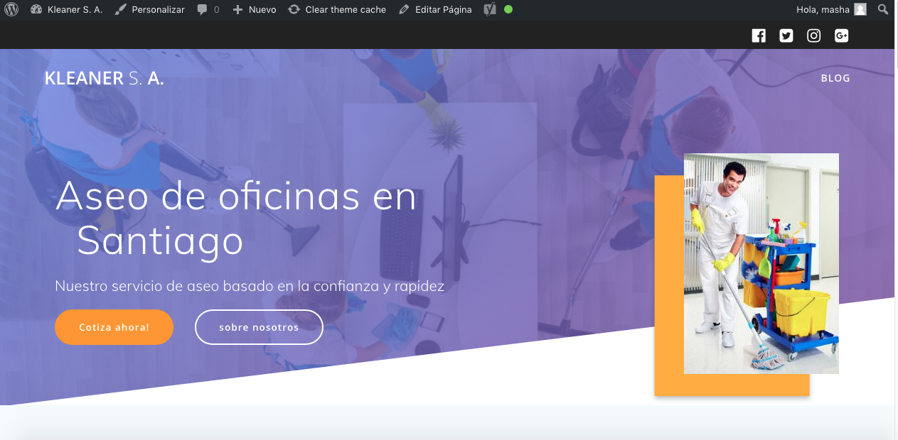
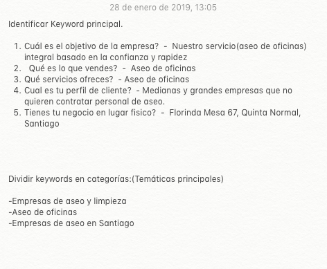
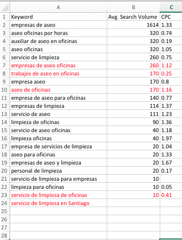
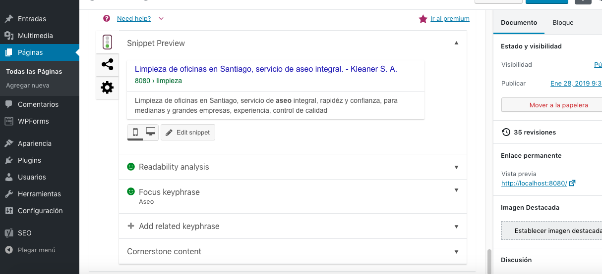
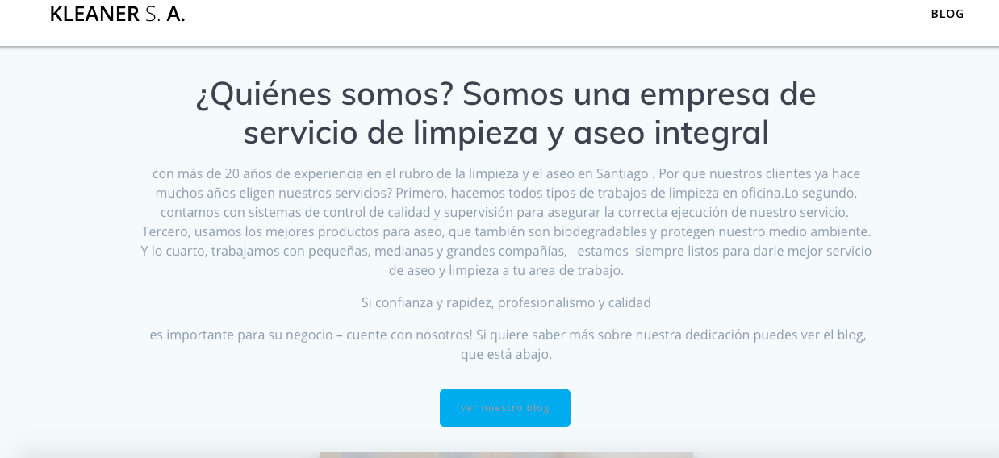
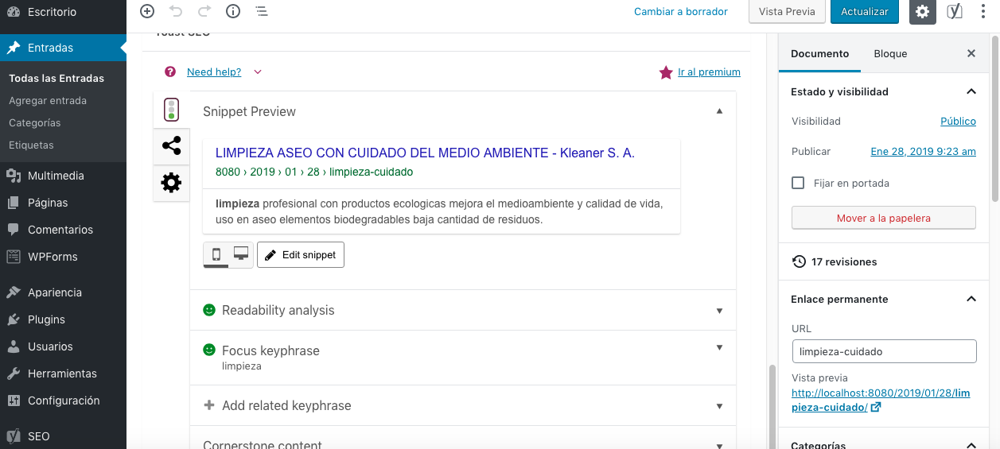
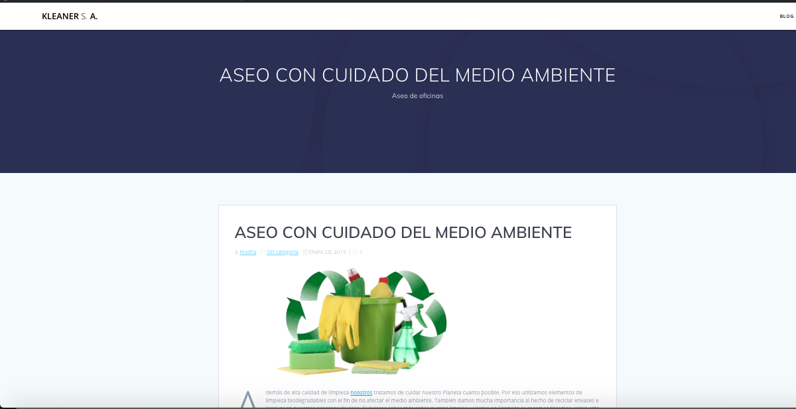

#Desafio SEO

1.Página web:

  - Instalar Wordpress de manera local
  - Descargar desde el repositorio de Wordpress el tema Mesmerize, instalar y activar el tema, descargar los plugins que pide el tema.
 - crear dos páginas: 'inicio' y 'blog'y una entrada. 
 - configurar inicio y blog para que estén por defecto.
 
 Screenshot de sito: 
[sitio](screenshots/sitio.png)

2.SEO:

- Buscar el público objetivo de la empresa:
   - Medianas y grandes empresas que no quieren contratar personal de aseo.
 
- Crear una hoja de cálculo y categorizar las keywords:
      [categorizar](screenshots/keywords.png)
      

- Hacer la primera búsqueda de keywords usando Übersuggest.
- Mejorar las keywords usando Kw finder o Keyword Difficulty Tool.
       [categorizar](screenshots/keywords2.png)
      
- installacion de plugin Yoast SEO.
- Integración de keywords en el contenido principal de página web
   [pagina de inicio](screenshots/pagina_inicio.png)
   
   
   [pagina de inicio](screenshots/pagina_inicio2.png)
   
- Creación de contenido original en una entrada de blog

   [entrada](screenshots/entrada.png)
   
   
   [entrada](screenshots/entrada2.png)
   

